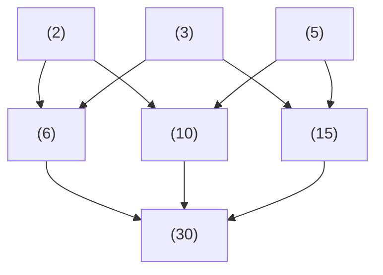

## Lecture 1
### Warm-up

## Lecture 3
### Warm-up
$$Z/n Z \rightarrow n=10 \rightarrow Z/n Z$$
1.  $3 \in [14]$   
 False, $10 \nmid (14-3)$
2.  $-4 \in [14]$  
 False, $10 \nmid (14-(-4))$
3.  $[14]=$?   
 $\{\ldots,-16,-6,4,14,\ldots\}$
4.  Describe $[14] \bigcap N$ as a subset of $Z$.   
 $\{4,14,24,\ldots\}$ , the last digit is $4$ in base $10$
### Notation 
$a \sim b$ iff $n|(a-b) \Rightarrow a \equiv b (mod \quad n)$
### Z/nZ: Act II 
Remark: $Z/n Z$ consists of subsets of $Z $   
  
$Z/n Z$ has exactly n elements   
  
#### Proof
  
if $[i] \bigcap [j] \neq \emptyset$, then $[i]=[j]$    
  
Let $x\in [i] \bigcap [j]$, then 
$$x\in [i] \Leftrightarrow  x=1+na, a \in Z$$
$$x\in [j] \Leftrightarrow  x=1+nb, b \in Z$$
then, $$i+na=x=j+nb \Rightarrow i-j=n(b-a)$$ 
$$n|(i-j) \Leftrightarrow i \sim j\Leftrightarrow [i]\sim [j] $$  
  
if $i \neq j$ and $0 \leq i,j \leq n-1$, then $[i] \bigcap [j] = \emptyset ($[i] and [j] do not intersect $)$   
  
We prove by contradiction:  
assume $$[i] \bigcap [j] \neq \emptyset$$
then,
$$x \in [i] \bigcap [j] \\ i-j=n(b-a)$$
According to $0 \leq i,j \leq n-1$, we have $ n>|i-j|=n\cdot |b-a| \Rightarrow 1>|b-a|$  
Since a and b are integers, we have$$b=a$$
and since we have,
$$x=i+na\\ x=j+nb$$
$$\Rightarrow i = j$$
which caused a contradiction, and it should be $[i] \bigcap [j] = \emptyset$. Proved.
  
Every $x \in Z$ belongs to one of the classes $[0],[1],[2],\ldots,[n-1]$
  
Proof:  
By $\textbf{claim 2}$, $Z/nZ$ has at least n elements.
By $\textbf{claim 3}$, $Z/nZ$ has at most n elements. 
### (Z/nZ,+)
Q: How to "add" $[a]$ and $[b]$?  
A: $[a]+[b]=[a+b]$  
  
 Addtion is correctly define on $Z/nZ$ ,the class $[a]+[b]=[a+b]$ is the same for diff. elements of $[a]$ and $[b]$.
   
Proof: 
$$a_1,a_2 \in [a]\\
b_1, b_2 \in [b]\\
[a_1+b_1]=[a_2+b_2]\\
\Leftrightarrow a_1+b_1 \sim a_2+b_2\\
\Leftrightarrow n|(a_1-a_2+b_1-b_2)$$
## Lecture 4
### Warm-up
For which a,b holds:$log(a \cdot b) =loga+logb$   
<!-- $a>0,b>0,a,b \in R$  -->
$a,b \in R_{>0}$    
2.For which a,b holds:$e^{a+b}=e^a e^b$  
$a,b \in R$
### Groups 
#### (Z/nZ,+)
$\rightarrow$ $[0]$ is a special  element:$[a]+[0]=[0]+[a]=[a]$  
$\rightarrow$ $[-a]$ exists: $[a]+[-a]=[0]=[-a]+[a]$  
$\rightarrow$ $[a]+[b]=[b]+[a]$   
$\rightarrow$ $(Z/nZ, +)=<[1]|[1]+[1]+ \ldots [1]=[0](n times)>$  (generator|relations)  
$[k]=[1+1 \ldots +1]=[1]+[1]+\ldots+[1]$
#### (Z/nZ,$\times$)
$\rightarrow$ $[1]$ is a special element:$[1] \cdot [a]=[a] \cdots [1]=[a]$  
$\rightarrow$: not always multiplicative "inverse"  
Warning: $n=15$, $[2] \cdot [8] =[16] = [1]$, sometimes you do have inverse.  
$\rightarrow$ $[a] \cdot [b] = [b] \cdot [a] = [a \cdot b ]=[b\cdot a ]$  
$\rightarrow$   the same but only finite primes are used. $\Rightarrow$ finitely generated(just need finite generator to generate all of them)
    
A group $(G, \star)$ is a set G and a binary operation $\star: G \times G \rightarrow G$ s.t. $\forall (g_1,g_2)$, $\star(g_1,g_2)=g_1 \star g_2$  
   
$\rightarrow$ Associativity: $(a \star b) \star c=a \star(b \star c)$  
$\rightarrow$ Identity: $\exists e=e_G \in G, \forall a \in G:a \star e=e \star a =a$  
$\rightarrow$ Inverses: $\forall a \in G, \exists a^{-1} \in G: a\star a^{-1} =a^{-1} \star a =e$  
PS: sometimes, $(G,\star)$ is written as $(G,\star, e,()^{-1})$ (more specific?)  
Q: Why "groups"?   
A1:  
 $\rightarrow$ Symmetries of "objects"  
 $\rightarrow$ it shouldn't be only about groups!(CS: monoids:associativity+identity)  
Q: What to do now?  
A2:   
$\rightarrow$ to deduce something from associativity+ identity+ inverses  
$\rightarrow$ clarify something? 
### Homomorphism
    
A homomorphism from $(G,\star)$ to $(H,\odot)$ is a map (of sets) $f:G \rightarrow H$,s.t.$\forall x,y \in G, f(x \star y)=f(x) \odot f(y)$
   
like $$log(a \times b)=log(a)+log(b) \Rightarrow log:(R_{>0},\times)-\rightarrow (R,+)$$
$$exp(x+y)=exp(x) \times exp(y)$$
## Lecture 5
### Warm-up
1.$$(-i)^{39}=?$$
Ans:
$$(-i)^{39}=(-i)*(-1)^{19}=i$$  
2.Solve for $x$ in $Z/nZ$
$$5x \equiv 0 (mod \quad 10)$$
$$x=\{\ldots -4,-2,0,2,4,\ldots\} \text{or }[0],[2],[4],[6],[8]$$
$$5x \equiv 1 (mod \quad 10)$$
$$\text{Maybe no solution for this question?}$$
3.What did we cover last time in class?
$$1.\text{Comparation between }(Z/nZ,+) \text{and} (Z/nZ,\times)$$
$$2.\text{Definition of Groups  and 3 properties(associativity,identity,inverses)}$$
$$3.\text{Definition of Homomorphism("kind of related structures")}$$
### Groups:Basic Properties
    
Identity element e is laways unique in any group G.  
  
Proof. By contradiction
$$e_1 \neq e_2 \text{ are both identities in G}$$
$$e_1=e_1 e_2(e_2\text{is identity})=e_1e_2(e_1 \text{is identity})=e_2$$
which caused a contradiction $e_1=e_2$
    
$G$ is a group. The inverse $(a^{-1})$ is unique 
  
Proof: By contradiction
$$\exists a \in G, \exists (a^{-1})_1(=x),(a^{-1})_2(=y) \text{are both inverses to } a \in G \text{ and } x\neq y 
$$
$$x=x \cdot e(\text{y is inverse of a})= x \cdot(a \cdot y)=(x \cdot a )\cdot y(\text{x is inverse of a})=y$$
which caused a  contradiction that $x=y$
    
For any $a,b \in G,(a\cdot b)^{-1}=b^{-1}a^{-1}$
  
Proof:
$$ab(ab)^{-1}=e \\a^{-1} ab(ab)^{-1}=a^{-1}e\\b^{-1}b(ab)^{-1}=b^{-1}a^{-1}\\(ab)^{-1}=b^{-1}a^{-1}$$  
    
$\forall g \in G, (g^{-1})^{-1}=g$
  
Proof: 
$$(g^{-1})^{-1}=e(g^{-1})^{-1}=g(g^{-1}(g^{-1}))^{-1}=ge=g$$
    
For any $a,b \in G, \exists x !| ax=b$ 
 
Proof:
$$ax=b\\a^{-1}(ax)=a^{-1}b\\(a^{-1}a)x=a^{-1}b \rightarrow x=a^{-1}b$$ 
    
$\forall a,b \in G ,\text{ if } ac=bc, \text{ then } a=b \\ \text{if} ca=cb, \text{then } a=b$ 
   
Proof:
$$
(ac)c^{-1}=(bc)c^{-1}\\
a(cc^{-1})=b(cc^{-1})\\
a=a \cdot e = b \cdot e =b
$$
### Subgroup
$a^{-k}, \ldots, a^{-1},a,a^2,a^3,a^4 \ldots, a^n$ is subgroup of G generated by $<a>$
## Lecture 6
### Warm-up
How many different ways to put $A,B,C,\ldots,Z$ on $\textcircled{1},\textcircled{2},\textcircled{3},\ldots,\textcircled{k}$  
Ans:
$$\textcircled{1} \quad 3!$$
$$\textcircled{1} \quad k!$$
### Symmetric Groups
    
Let $X$ be a set, we define $Sym(X)=S_x=S_{|x|}$(cardinality of X=number of elements in X) is a group of all bijective maps $f:X\rightarrow X$(bijections)   
  
Operation on $Sym(x)$:
$$f:X\rightarrow X$$
$$g:X\rightarrow X$$
"composition $f \circ g:X\rightarrow X$ of functions" composition of maps  
$$f \circ g: X \rightarrow X$$
$$x \searrow  g(x) \nearrow (f(g(x)))$$
    
$\textcircled{1}$ Operation of composition (of maps) is associative   
$\textcircled{2}$ Identity: $id=id_x:X\rightarrow  X(x \rightarrow id_X(x)=x)$  
$\textcircled{3}$ Inverses:?  
  
Examples:$X$ is a finite set.
$$X=\{1\},S_x=S_1:1\mapsto 1 (\text{only identity}),S_1=\{id_x\}$$
$$X=\{1,2\},S_x=S_2:1\mapsto 1(idx),2\mapsto 2 \text{ or } 1\mapsto 2, 2 \mapsto 1$$
$S_2$ has two elements."transpositions"=maps which intercharges only tow elements.  
$\rightarrow X=\{1,2,3\}:S_3$ has exactly 6 elements($3 \times 2 \times 1=6$)  
Q:How to think about elements of $S_n, n \in N$?  
A_0: functions which are bijective.  
A_1:$2 \times n $ "matrices",
$$
\left[\begin{array}{c}
1 & 2& 3& 4 \\
3 & 4& 1& 2
\end{array}\right]
$$
the first row: original set, the second row: image of $\sigma$
$$
\left[\begin{array}{c}
1 & 2& 3& 4 \\
\sigma{(1)} & \sigma{(2)}& \sigma{(3)}& \sigma{(4)}
\end{array}\right]
$$  
A_2: "strings"$\sigma$:   
Example:$\sigma \in S_4$,  
Q: composition via strings?  
"$f \circ g(x)$" first $g(x)$, second $f(g(x))$, 
     
A_3: cycles presentation  
Example: $\sigma=(1\quad 3)(2 \quad 4)$ (1 goes to the 3, and 3 goes to the 1 $\ldots$)
$\sigma=(1\quad 3 \quad 2)$(1 goes to the 3, 3 goes to the 2, and 2 goes to the 1)
    
just flip it  
  
## Lecture 7
### Warm-up
1.Prove that $3Z=\{k \in Z | 3 | k\}$ with $+$ is a group.  
Proof:  
1.Associativity: $$a \star (b \star c)=a \star (b + c)= a+b+c=(a+b)+c=(a\star b) \star c$$
$$3\hat{a}+(3\hat{b}+3\hat{c})=(3\hat{a}+3\hat{b})+\hat{c}=3\hat{a}+3\hat{b}+3\hat{c}$$
2.Identity:
0 serves as the identity, since $$a \star 0=0 \star a =0+a =a$$
3.Inverses:
Every element have inverses. Inverse of $a$ is $-a$, such that
$$a+(-a)=0=e$$ 
2.How to find new examples of groups?  
We can explore new groups by identifying subgroups of existing groups. Utilizing Existing Group Structures:
By adding constraints to existing groups, such as restricting certain properties (e.g., determinant = 1 for matrices), you can form new groups. The example of $SL_2(R)$ and $GL_2(R)$ shows how restricting the determinant of matrices creates the special linear group.
$$2Z,3Z,5Z,7Z$$
### Subgroups
    
$G=(G,\star)$ is a group, Subgroup $H$ of $G$ is a group $H$ with the group operation restricted from $G$.
  
About restrictions of functions:
       
Back to Subgroups:
$$\star: G \times G \rightarrow G$$
$$\text{Notation1:}\star: H \times H \rightarrow H \\ Notation2: \star|_H$$
Examples: $$(G,+)=(Z,+)$$
For every $n \in N(nZ,+)$: $n Z=\{k \in Z |n|k\}=\{n\cdot e|e \in Z\}$  
$(Z/3Z,+)$ consists of $[0],[1],[2]$, where $[1]+[1]=[2]$,$+$ is "almost the same" as $+$ on $Z$.And $(Z/3Z,+)$ is not a subgroup od $(Z,+)$. Actually, operation is not the same(counterexamples:$[1]+[2]=[0]$ ).
    
Subgroup diagram of a group $G=(G,\star) $,trival subgroup($(\{e\},\star)$) $\subset  G$,$(H,\star) \subset (K,\star) \subset (G,\star)$ is contained as a set. They are all subgroups of $(G,\star)$  
  
    
    
Proper subgroup of $G$ is subgroup which is not trivial or $G$ itself.   
  
    
$H \subseteq G$ is a subgroup of $G$ iff: 
1.(identity of subgroup)$e_G\in H$    
2.(closure of the group operation)if $h_1,h_2 \in H$, then $h_1\star h_2 \in H$,   
3.(closure of inverses)if $h \in G$, then $h^{-1} \in H$. 
  
$\Leftarrow$ is Problem #2  on HW#3  
$\Rightarrow$ $H$ is a subgroup $\Rightarrow$ that all of three is true  
    
$H \subseteq G$ is a subgroup iff ($H \neq \emptyset $) and ($\forall g,h \in H:gh^{-1} \in H$)
  
Proof:(follows from 3.30): 
$$\rightarrow:e_G \in H ?$$
$$g=g,h=g:g \cdot g^{-1}=e_G \in H$$
$$\rightarrow h_1 \star h_2 \in H,g=h_1,h=h_2^{-1}:h_1 \star(h_2^{-1})^{-1} =h_1 \star h_2 \in H$$
$(H,\star,e_H,()_H^{-1})$ is a subgroup in $(G, \star,e_G,()^{-1})$  
$Q_1$:$e_H=e_G?$
$$e_H=e_G \cdot e_H$$
$$e_H=e_H \cdot e_H$$
Cancellation law on the right,
## Lecture 8
### Warm-up
Find all subgroups of $S_3$
$$\{id\},\{id,(12)\},\{id,(13)\},\{id,(23)\},\{id,(123),(132)\},S_3$$
 
### Notation
if $H$ is a subgroup of $G$, we write $H \leq G, G \geq H$, and if $H \neq G,H < G$ 
### Cyclic Subgroups
if $a \in (G, \star)$, we have $a^{-2},a^{-1},e_G,a, a^2, a^3$  
    
$<a>$= cyclic subgroup if $G$ generated by $a$ as a set $\{a^k | k \in Z\}$ and the operation $\star = \star_G$  
  

    
$<a>=\{a^k|Z\}$ is a subgroup of G  
  

Proof. By Prop3.31
if $g,h\in H$, then $g \star h^{-1} \in H$
$$g,h \in \{a^k|k \in Z\}$$
$$g=a^x,h=a^y,x,y \in Z$$
$$\therefore g \star h^{-1}=a^{x-y}, \text{as } x,y \in Z$$
$$\text{we see that } g\star h^{-1} \in \{a^k| k\in Z\}$$
    
$<a>$ is a subgroup and it's minimal subgroup $H \leq G \quad s.t. \quad  a \in H$
  
Proof: $1^{st}$ part is already proved.Let us prove the second part.Any subgroup $H \leq G: a \in H$, then $a^{-1} \in H, a^2 = a \star a \in H \Rightarrow \forall k \in Z, a^k \in H$
$$\forall k \in Z, a^k \in H, \text{then} <a> \leq H$$
Therefore $<a>$ is minimal subgroup $H$ of $G$ with $a \in H$
    
$G \ni a$,Order of $$ is minimal $n \in N$,s.t. $a^n = e_G$
  
Notation:
$$|a|=n$$
Examples: $$(Z,+)=<1>=\{1+1+\ldots 1|n \in N\}\bigcup \{(-1)+(-1)+\ldots (-1)| m \in N\}\text{of infinite order}$$
$$(Z/nZ,+)=<[1]|[1]+[1]+\ldots+[1]=[0]>\text{where [1] has order n in }Z/n\text{ of order n}$$
    
$G$ is cyclic iff $\exists g \in G, G=<g> $
  
Example ? $$S_3 \text{ is cyclic?} \quad \times$$ 
$$S_3 = \{id, (12),(13),(23),(123),(132)\}$$
    
Every cyclic group is abelian, $\forall a,b \in G, a \star b = b \star a$
  
## Lecture 9
### Warm-up
$F:GL(2,R) \rightarrow GL(2,R)$ is defined by $F(A)=A \times A$.Is it a homomorphism?($GL(2,R)$ is all invertible $2 \times 2$ matrices with all entries from $R$)  
Maybe it's not.
$$F(A \times B)=ABAB \neq AABB=F(A) \times F(B)$$
If $F$ is a homomorphism:$$F(A \times B)=F(A) \times F(B)$$
$$\Leftrightarrow (AB)^2=A^2 \times B^2$$
$$\Leftrightarrow ABAB=AABB $$
$$\Leftrightarrow BA=AB$$
which is not true obviously.
### Isomorphism
    
Isomorphism is bijective homomorphism.$f:(G,\star)\rightarrow (K,\circ),f(g \star h)=f(g) \circ f(h)$(which is bijective：injective,subjective)  
  
Example:  
    
$\phi:G \rightarrow H, G$are groups and they are homomorphism, then:  
1.$\phi(e_G)=e_H$  
2.$\phi(g)^{-1}=\phi(g^{-1})$  
3.if $K \leq G$, then $\phi(K) \leq H$  (image of $K$ under $\phi$)  
3'. as $G \leq G$, then $\phi(G) \leq H$(image of $\phi$ : $Im(\phi)$)  
4. if $M \leq H$, then $\phi^{-1} (M)= \{g \in G, \phi(g) \in M\}$ is a subgroup of G (we call $\phi^{-1}$ is called pre-image of $\phi$)   
  
Proof.
1.$e_G \phi(e_H)=\phi(e_H e_H)=\phi(e_H)\phi(e_H) \Rightarrow e_G=\phi(e_H)$  
2.$\phi(g^{-1})\phi(g)=\phi(g^{-1}g)=\phi(e_G)=e_H$
3.  
4. Let us consider $M=\{e_H\}, \phi^{-1}(\{e_H\})=\{g \in G, \phi(g)=e_H\}$ is a subgroup?  
Prop 3.31: $g,h \in \phi^{-1}(\{e_H\}) \Rightarrow ? g\cdot h^{-1} \in \phi^{-1}(\{e_H\})$
$$g, h \in \phi^{-1}(\{e_H\}) \Leftrightarrow \phi(G)=\phi(H)=e_H$$
$$g\cdot h^{-1} \in ? \phi^{-1}(\{e_H\}) \Leftrightarrow \phi(gh^{-1})=? e_H$$
$$\phi(gh^{-1})=\phi(g)\phi(h^{-1})=e_He_H^{-1}=e_H$$
    
Kernel of $\phi$, Kernel is the preimage of identity: $\phi:G \rightarrow H,Ker(\phi)=\{g \in G:\phi(g)=e_H\}$
  
## Lecture 10
### Warm-up
$G=GL(2,R)$=$\{2 \times 2 \text{invertible R-matrices}\}$,$H=\text{diagonal subgoroup=\{[a 0; 0 b]\}}$ of G ,is it true that $g_1 \in g_2H$, if 
$$1) g_1 = \begin{pmatrix} 9 & 10 \\ 21 & 8 \end{pmatrix}, \quad g_2 = \begin{pmatrix} 3 & 5 \\ 7 & 4 \end{pmatrix}
$$
$$1) h = \begin{pmatrix} 3 & 0 \\ 0 & 2 \end{pmatrix}
$$
$$2) g_1 = \begin{pmatrix} 39 & 560 \\ 91 & 448 \end{pmatrix}, \quad g_2 = \begin{pmatrix} 3 & 5 \\ 7 & 4 \end{pmatrix}
$$
$$2) h = \begin{pmatrix} 13 & 0 \\ 0 & 112 \end{pmatrix}
$$
Reformulation: $ \exists h \in H, g_1=g_2h, \exists a,b \neq 0: g_1 =g_2 \cdot  \begin{pmatrix} a & 0 \\0 & b\end{pmatrix}$
$$
\begin{pmatrix} 9 & 10 \\ 21 & 8\end{pmatrix} =\begin{pmatrix} 3 & 5 \\ 7 & 4\end{pmatrix} \cdot \begin{pmatrix} a & 0 \\ 0 & b\end{pmatrix} \Rightarrow h = \begin{pmatrix} 3 & 0 \\ 0 & 2 \end{pmatrix}
$$
$$
\begin{pmatrix} 39 & 560 \\ 91 & 448\end{pmatrix} =\begin{pmatrix} 3 & 5 \\ 7 & 4\end{pmatrix} \cdot \begin{pmatrix} a & 0 \\ 0 & b\end{pmatrix} \Rightarrow h = \begin{pmatrix} 13 & 0 \\ 0 & 112 \end{pmatrix}
$$
### Coset
    
$H \leq G$, $\forall g \in G,gH=g \star H=\{g \star h| h \in H\}$ is the coset of $g$.  
  
    
The following are equivalent(1-3 therioticallt useful, 4 griginal warm-up, 5 How to use this lemma for actual $G,H,g_1,g_2$)  
$\rightarrow g_1H=g_2H$  
$\rightarrow Hg_1^{-1} =Hg_2^{-1}$  
$\rightarrow g_1H \subset g_2H$  
$\rightarrow g_2 \in g_1H$  
$\rightarrow g_1^{-1} g_2 \in H$  
  
Q: Why do we need cosets?  
$A_1:$ It happens:Example:
$$(Z,+)=G,(5Z,+)=H \Rightarrow g_1 \in g_2H, g_1 \in \{g_2+5Z\}=[g_2](mod \quad 5)$$
$$\rightarrow g_1-g_2 \in 5Z, g_1 \equiv g_2 \text{(mod 5)}$$
    
H-cosets partition G: we can find $\{g_i\}$ a set of elements of $G$ such that $G=g_1H \bigcup g_2H \bigcup \ldots$ that $g_iH \bigcap g_j H = \empty$
  
Example:$G=Z,H=5Z$
Explain Theorem 6.4 in this case: what are these $g_iH$?
$Z=\{0+5Z\} \sqcup \{1+5Z\} \sqcup \{2+5Z\} \sqcup \{3+5Z\} \sqcup \{4+5Z\}$(these are equivalence classes)  
Reminder: originally, $a \sim b$ or $a \equiv b(mod 5)$ iff $5|(a-b)$  
The set of equivalence classes:$Z/5Z$  
Set of equivalence classes for the equivalence relation $g_1 \sim g_2$ iff $g_1 \star g_2^{-1} \in H$ is denoted bt $G/H$(just like $Z/5Z$)
    
Lagrange's Theorem  
$G$= finite group, $H \leq G$, $|G|=|H| \cdot |G/H|$(Note: all three are natural numbers)  
  
    
$g \in G$, $|g| | |G|$(Remember, $|g|$= order of $g$=minimal $n$ s.t. $g^n=e$)  
  
## Lecture 11
### Warm-up  
Are $Z/6Z$ and $S_6$ isomorphic?  
$Z/6Z$ is a cyclic group and $S_6$ is not, they cannot be isomorphic.The group $Z/6Z$ has order 6, but $S_6$ cannot be generated by any single element, and the orders of elements in $S_6$ vary.    
Also,the number of elements in $Z/6Z$ and $S_6$ are different.  
Therefore, as isomorphic groups must have the same structure and element orders, $Z/6Z$ and $S_6$ cannot be isomorphic.  
1.$Z/6Z$ is abelian,m but $S_3$ is not.  
2.$Z/6Z$ is cyclic, but $S_3$ is not.  
3.$a^2=1$  
$[a]+[a]=[0]$, solutions are $[a]=0,[a]=[3]$  
$a \circ a=id$, solutions are $a=id,(12),(13),(23)$
### Isomorphisms
    
Isomorphism is bijective homomorphism.$f:(G,\star)\rightarrow (K,\circ),f(g \star h)=f(g) \circ f(h)$(which is bijective：injective,subjective)  
  
Examples:$(R,+) \overset{\leftarrow}{\rightarrow} (R_{>0},\times) \rightarrow$ HW3, Problem 1.7  
$exp(),Z/nZ \rightarrow <(12\ldots n)>$  
$[a] \rightarrow (12\ldots n)^a$  
Q:injective?  
$(123),(123)^2=(132),(123)^3=id$  
$(123)^a=(123)^b \Leftrightarrow a\equiv b(mod 3) \Leftrightarrow [a]=[b]$  
eg. $a=2,b=5$  
$Z/3Z:[0],[1],[2]$   
proved  
Q:surjective?
$G$ is a finite group, $\sigma \in G$ of order n: $\sigma^{n}=e_G$,but $\sigma^{k} \neq e_G$ for $\forall k<n$  
$G=S_n, \sigma=(12\ldots n)$, order of $\sigma = |\sigma|=n$  
$f:Z/nZ \rightarrow <\sigma>=\{e_G,\sigma,\sigma^2,\sigma^3 \ldots, \sigma^{n-1}\}$  
$[a]\rightarrow \sigma^a$ is surjective.
    
If $G$ is a cyclic group, then:  
$\rightarrow$ if it is finite order(n), then it is isomorphic to $Z/nZ$.  
$\rightarrow$ if it is of infinite order, then it is isomorphic to $Z$.
  
  
$\rightarrow$ if $G \neq H$ are isomorphic, then,then other is.
$\rightarrow$ if $G \neq H$ are finite, then,then other is.
$\rightarrow$ if $G \neq H$ are cyclic, then,then other is.
  
### (External) Direct Product
Idea: every "object" is easier when it's decomposed into smaller simple pieces.  
    
$G,H$ are groups, direct product of $G$ & $H$ is a set $G \times H=\{(g,h)| g \in G, h \in H\}$ with the following operation $(g_1,h_1) \cdot (g_2,h_2)=(g_1g_2,h_1h_2)$  
  
$\rightarrow$  associativity: check coordinate wise.  
$\rightarrow$  identity:$(e_G,e_H)$  
$\rightarrow$  inverses:$(g,h)^{-1}=(g^{-1},h^{-1})$

## Lecture 12
### Warm-up
1.What subgroups of $Z/6Z$  and $S_3$ are normal?  
every subgroup of $Z/6Z$ is normal.($\{[0]\},\{[0],[3]\},\{[0],[2],[4]\},Z/6Z$)$[1],[5]$ is the generator of $Z/6Z$  
$S_3,\{e\},<(123)>$  
$gS_3=S_3g=S_3$   
2.Where (0-100) the median( and average) should be for fair grading?  
80
### Normal Subgroups and Factor/Quotient groups
    
$H \leq G$, $H$ id normal iff $\forall g \in G, gH=Hg$  
iff $\forall g \in G:gHg^{-1}=H$  
 
      
 if $G$ is abelian, then every subgroup is normal.  
 
Proof:  
$\forall g,h \in G: gh=hg.$ We have $gH=Hg$, as $gh \leftrightarrow hg$  
Q: Why do we need the definition of normality  
Idea: $H \leq G$, $G/H=\{eH=H, g_1H,g_2H\}$, we want group operation on $G/H$(factor/quotient group of $G$):
$$aH \star bH =(ab)H$$
$$a'H \star b'H =(a'b')H$$
such that $aH=a'H,bH=b'H$  
Problem: if $(ab)H \neq (a'b')H$  
How to deal with such sits? Whether 
$$aH \star bH=abH$$
or not.  
$$abb^{-1} H bH = abH$$
$$b^{-1}HbH=H$$
$$b^{-1}Hb=H\leftarrow \text{How we defined normal subgroup}$$

(Remark: $eH \star gH=gH$, it is really good!)
### First Isomorphism Theorem
    
if $f:G \rightarrow H$ is a homomorphism  
$Im(f)=$ image of $f=\{h \in H | \exists g \in G, f(g)=h\}$  
$Ker(f)=$ kernel of $f=\{g \in G: f(g)=e_H\}$  
 
 
    
 if $\phi: G \rightarrow H$ is a homomorphism, then $Im (\phi)\overset{\sim}{=}G/Ker(\phi)$  
 ($\overset{\sim}{=}$ means isomorphic, $\exists \Phi: Im \phi \rightarrow G/Ker \phi$ is bijective)
   
Sketch of Proof:
1. $Ker \phi$ is normal, $\forall g \in G, g Ker \phi g^{-1} \subset Ker \phi$
$$\phi(gag^{-1})=\phi(g) \phi(a) \phi(g^{-1}) = \phi(g) \phi(g^{-1})=e_H(a \in Ker \phi)$$
2.To find $\Phi$
## Lecture 13
### Warm-up
Prove that $D(2,R) \overset{\sim}{=}R^{\times} \times R^{\times}$  
Proof.
define a map
$$\phi (\begin{pmatrix} a & 0 \\ 0 & b\end{pmatrix})=(a,b)$$
$D(2,R)$ is the inertial product of $R^{\times} \times R^{\times}$  
1.injective  
$\begin{pmatrix} a_1 & 0 \\ 0 & b_1\end{pmatrix} \neq \begin{pmatrix} a_2 & 0 \\ 0 & b_2\end{pmatrix}$ means $a_1 \neq a_2$ or $b_1 \neq b_2 \Rightarrow (a_1,b_1) \neq (a_2,b_2) \Rightarrow (\phi(\begin{pmatrix} a_1 & 0 \\ 0 & b_1\end{pmatrix}) \neq \phi(\begin{pmatrix} a_2 & 0 \\ 0 & b_2\end{pmatrix}))$   
2.surjective  
all of the elements in $D(2,R)$ can be mapped to $R^{\times} \times R^{\times}$  
3.homomorphism
$$\phi (\begin{pmatrix} a_1 & 0 \\ 0 & b_1\end{pmatrix})\phi (\begin{pmatrix} a_2 & 0 \\ 0 & b_2\end{pmatrix})=(a_1,b_1) \times (a_2,b_2)=(a_1a_2,b_1b_2)=\phi (\begin{pmatrix} a_1a_2 & 0 \\ 0 & b_1b_2\end{pmatrix})$$
Correct Proof.
$\begin{pmatrix} a & 0 \\ 0 & b\end{pmatrix}=\begin{pmatrix} a & 0 \\ 0 & 1\end{pmatrix}\begin{pmatrix} 1 & 0 \\ 0 & b\end{pmatrix}$  
By theorem9.27, $D(2,R) \overset{\sim}{=}H \times K$
### Direct Products
External:  
$$G,H\text{-groups}$$
$$G \times H = \{(g,h)| g \in G, h \in H\}$$
$$(g_1,h_1) \circ (g_2,h_2)=(g_1g_2,h_1h_2)$$
Internal:
    
$G$ is a group, $H,K \leq G$, $G$ is the internal direct product of $H$ and $K$ iff  
1.$G=H \cdot K=\{h \cdot k | h \in H, k \in K\}$(warning: $H \cdot K \neq H \times K$)  
2.$H \bigcap K = \{e_G\}$(i.e. as samll as possible)  
3.$hk=kh$ for any $h \in H, k \in K$(warning: G is not abelian)   
 
    
if $G$ is internal direct product of $H,K$, then $G \overset{\sim}{=} H \times K$    
 
($G$, internal direct product, $H \times K$, external direct product)  
Proof.  
Let's consider $\phi : G \rightarrow H \times K$
$$\phi: G \rightarrow H \times K$$
$$g= h \cdot k \mapsto (h,k)$$
Q: is it well-defined?
A: $h'k'=hk \Rightarrow h^{-1}h'=k(k')^{-1}$  , by 2, we know that 
$$h=h',k=k' \Leftarrow h^{-1}h'=e_G=k(k')^{-1}$$
Q:homomorphism?  
$$\phi(g_1,g_2)=\phi(g_1)\phi(g_2)$$
$$\phi(g_1)=(h_1,k_1)$$
$$\phi(g_2)=(h_2,k_2)$$
$$\phi(g_1g_2)=\phi(h_1 k_1 h_2 k_2)=\phi(h_1 h_2 k_1 k_2)=(h_1 h_2,k_1 k_2)=(h_1,k_1) \cdot (h_2,k_2)=\phi(g_1) \phi(g_2)$$
+surj+inj
## Lecture 14
### Warm-up
is $(R^{\times},\times)$ finitely generated?   
My answer:
No. Prove by contradiction  
if it is finitely generated, $\forall r \in R^{\times},r=g_1^{\alpha_1}g_2^{\alpha_2} \ldots g_n ^{\alpha_n}$, $\alpha_i \in Z$, let $g_1 <g_2 < \ldots <g_n$  
Now, consider $r=g_1^{\frac{1}{2}} \in R^{\times}$,it cannot be generated by mutiples of $g_1$ to $g_n$, so it cannot be finitely generated  
Ans:No  
Hint: use induction on m  
### Abelian World
    
Every finite abelian group $G$ is isomorphic to $G \overset{\sim}{=} Z^{b} \times Z/p_1^{\alpha_1} \times Z/p_2^{\alpha_2} \times \ldots \times Z/p_m^{\alpha_m}$, where $p_1,\ldots, p_m$ are primes and $a_1,\ldots, a_m$ are natural numbers.($Z^b$ is finite rank, the rest are finite piece)  
 
Examples:  
$Z/2Z=Z/p_1^{\alpha_1}$, where $p_1=2, \alpha_1=1$  
$Z/4Z=Z/p_1^{\alpha_1}$, where $p_1=2, \alpha_1=2$  
$Z/5Z=Z/p_1^{\alpha_1}$, where $p_1=5, \alpha_1=1$  
$Z/6Z=Z/p_1^{\alpha_1}\times Z/p_2^{\alpha_2}$, where $p_1=2, \alpha_1=1, p_2=3, \alpha_2=1$  
Exercise: why? $Z/6Z=Z/2Z \times Z/3Z$  
$Find H \overset{\sim}{=} Z/2Z, K \overset{\sim}{=} Z/3Z, in G=Z/6Z$  
$\rightarrow Z/nZ \overset{\sim}{=} Z/p_1^{\alpha_1} \times Z/p_2^{\alpha_2} \times \ldots \times Z/p_m^{\alpha_m}$, where $n=p_1^{\alpha_1}p_2^{\alpha_2} \ldots p_m^{\alpha_m}$  
Proof of the theorem from Milne,Group Theory  
"Nonconstructive proofs": "Assume the opposite" :
$$G \overset{\sim}{=} Z/p_1^{\alpha_1} \times Z/p_2^{\alpha_2} \times \ldots \times Z/p_m^{\alpha_m}$$
$x_1 \in G, Z/p_1^{\alpha_1} =<x_1> ,Z/p_2^{\alpha_2} =<x_2>,\dots, Z/p_m^{\alpha_m} =<x_m>$ m + some assumption on $\{x_1,\ddots, x_m\}$, generate $\{y_1,y_2 \ldots, y_m\}$
## Lecture 15
### Warm-up
What is a symmetry of structure? What is structure?  
Structure: Structure refers to the set of rules and relationships that govern the elements within a mathematical object. Structure is typically defined by the elements themselves and the operations (such as addition, multiplication) between them, along with the axioms that these operations must satisfy. For example, the structure of a group consists of a set and a binary operation defined on that set, which must satisfy associativity,identity and inverses.  

Symmetry of structure: Symmetry refers to transformations that preserve the structure of an object. These transformations are often referred to as "automorphisms," which are bijective mappings from the object onto itself that preserve its operations. For instance, in geometry, rotating or reflecting a square preserves its shape, and this is an example of geometric symmetry. In algebra, automorphisms of a group are symmetries of the group structure, representing permutations that preserve the group's operation properties.
### Scenario1  
$\cdot$ n people  
$\cdot$ everyone votes 0 or 1  
$Q_0:$ How many outcomes?  
A: $2^n$,n+1,2(who wins)   
$\cdot$ some people know each other  
$Q_1:$
     
"some situations"="symmetric situations"
$Q_1:$  
   
### Lecture 16
### Review for Midterm I for Group Theory
Groups:abelian, non-abelian  
Notation:$[n]=$ a finite set with n elements  $=\{1,2,\ldots,n\}$  
Sets: $[1],[2],[3],[4],[5],[6],[7],[8],[9],[10],\ldots [\infty]$  
abelian groups:  
non-abelian groups:
## Lecture 16
### Warm-up
$R=(R,+)$  
what is $R \times R$ geometrically?  
Ans:coordinate, usually $R^2$   
$Z/pZ=(Z/pZ,+)$?  
Then, what about $Z/pZ \times Z/pZ$  
Abstract Linear Algebra

### Permutation Groups
$X$ is a set, $Sym(x)=S_x=S_{|x|}$, is group of all permutations(bijection $\phi: X \rightarrow X$) 
      
Permutation group G (on a set $X$ ) is a subgroup of $ Sym(X) $  
 
Example:  
1. $Sym(X)$ for any $X$
2. (last Friday Reading assignment) Cube thing, $G=$ symmetries of the cube.  

    
        
$X,G \leq Sym(X)$.For each $x \in X$(stabilizer of $x \in X$),$Stab_{G} (x)= \{ \sigma \in G, \sigma(x)=x \}=stab_G(x)=G_x$  
 
          
$Stab_G (x) \leq G$  
   
Back to Midterm: proper non-abelian subgroup of $S_4$, $S_4=Sym(\{1,2,3,4\}) \geq Stab_{S_4}(\{4\})=<(12),(13)>$
         
$x \in X$, Orbit of $x$ under $G$ is the full set $orb_{G}(x)=\{ g(x) | g \in G\}=Orb_G(x) =O_x=O(x)$  
 
Reminder: "$g(x)$ is just a bijective function"  
  
Example2: $Sym(\{1,2,3,4\})=S_4 \geq Stab_{S_4}(4)$  
Q:What are the $G$-orbits in $X$?  
$Orb_G(4)=\{4\}$, $Orb_G(1)=Orb_G(2)=Orb_G(3)=\{1,2,3\}$
          
if $G$ is finite, $|G|=|Stab_G (x)|\cdot|Orb_G (x)|$
   
## Lecture 17
### Warm-up
$G_1=<\alpha>,G_2=<\beta>,G_3=<\alpha,\beta>$  
1.$G_1-orbits? G_2-orbits? G_3-orbits?$   
My answer:  
$G_1-orbits:\{0\},\{1,2\},\{3\},\{4,5\}$  
$G_2-orbits:\{0,4,5\},\{1\},\{2,3\}$  
$G_3-orbits:\{0,4,5\},\{1,2,3\}$  
2.  
My answer:  
$Stab_{G_1}(0)=<\alpha>$  
$Stab_{G_2}(2)=\{e,\beta^2,\beta^4\}$   
$Stab_{G_3}(0)=\{e,\beta^3, \alpha,\alpha \beta^3\}$ 
### Group Actions
      
"$G$ acts on $X$" s the following map:  
$\Phi : G \times X \rightarrow X$  
$(g,x) \mapsto g \circ x = g(x)$,s.t.  
1.$\forall x \in X, e_G(x)=x$(intuition: $e_G$ "acts" as id)  
2.$\forall g_1,g_2 \in G, \forall x \in X$,$(g_1 \star g_2)(x)=g_1(g_2(x))$  
 
Examples: $X=\{1,2,3,4\}, G=S_4, \Phi: S_4 \times \{1,2,3,4\} \rightarrow \{1,2,3,4\}$  
$(\sigma, i )\mapsto \sigma(i)$, like $((1234),2)=3$
      
 "$G$ acts on $X$" by bijections: if you fix any $g \in G:\Phi(g,-)$ is a bijection of X  
 
$\Phi(g,-)$ is a function on $X:X \rightarrow X, x \mapsto \Phi(g,x)$  
Proof.  
bijection=injective+surjective  
Claim: $\Phi(g_1,g^{-1}(y))=y$  
$LHS=g(g^{-1}(y))=(g \star g^{-1})(y)=e_G(y)=y$ (surjective)  
assume $y=\Phi(g,x_1)=\Phi(g,x_2)$, if we apply $\Phi(g^{-1},-)$, then both $x_1, x_2$ are in the image.($x_1=\Phi(g^{-1},z_1)$,$x_2=\Phi(g^{-1},z_2)$)  
$\Rightarrow$ $\Phi(g,x_1)=\Phi(g,\Phi(g^{-1},z_1))=g(g^{-1}(z_1))=z_1$  
$\Phi(g,x_2)=\Phi(g,\Phi(g^{-1},z_2))=g(g^{-1}(z_2))=z_2$
$\Rightarrow x_1=x_2$
      
intuition: "$G$ act on $X$" is almost the same as $G \leq Sym(X)$, if $\Phi:G \times X \rightarrow X$,s.t. $1 and 2$, then $\phi:G \rightarrow SymX,g \mapsto \Phi(g,-)$ is a homomorphism
 
## Lecture 18
### Warm-up
$Z/4Z$ acts on (circle with 1 2 3 4 clockwise) by rotations.  
1.What is $X$?  
2.What is $G$ from Def2?  
3.What is $\tilde{G}$ from Def1?  
Answer:  
1.$Z/4Z=\{[0],[1],[2],[3]\}$,$[0]$ is "id" rotation,i.e. does nothing.  
Choice: $[1] \in Z/4Z$ "acts by" rotation,$1 \mapsto 2, 2 \mapsto 3,3 \mapsto 4, 4\mapsto 1$.  
$X=\{1,2,3,4\}$ but also the picture suggests additional structure of "circular order". i.e. a circle with 1,2,3,4 clockwise.  
2.$G=Z/4Z$, so Def.2:$Z/4Z$ acts on $\{1,2,3,4\}$  
$\Phi: Z/4Z \times \{1,2,3,4\} \rightarrow \{1,2,3,4\}$  
$([i],j) \mapsto ((j+i+3) mod \quad 4)+1$
### Group Actions
      
if $\Phi:G \times X \rightarrow X$ with 1 and 2, then $\phi: G \rightarrow SymX$($g \mapsto \phi(g)=(x \mapsto \Phi(g,x))$) is homomorphism  
   
By First Isomorphism Theorem for (for $\phi$): $G/Ker(\phi) \leq SymX$, where here $ker \phi$ is the kernel of action $\Phi:Ker\phi=\{g \in G: \forall x \in X:g(x)=x\}$  
Back to Warm-up:  
$\phi: Z/4Z \rightarrow Sym\{1,2,3,4\}=S_4([0] \mapsto id,[1] \mapsto (1234), [2]\mapsto (13)(24), [3]\mapsto (1432))$  
$\Rightarrow Ker \phi=Ker \Phi=\{[0]\}, Im(\phi)=\{id,(1234),(13)(24),(1432)\}=<(1234)>$   
3.$<(1234)> =\tilde{G} \overset{\sim}{=} G /Ker \phi=Z/4Z / \{[0]\}=Z/4Z$  
$Z/4Z \times\{[0],[1],[2],[3]\} \rightarrow \{[0],[1],[2],[3]\}$, $\Phi([i],[j])=[i+j] \leq [i]+[j]$  
      
$G=(G,\star),X=G$ as a set, $\Phi: G \times G \rightarrow G ,(g,h) \mapsto \lambda_{g}(h):= g \star h$.(Left regular action of G on itself)
  
      
Every group is isomorphic to a group of permutations
  
Sketch of proof:  
(Same as for $Z/4Z$)
## Lecture 19
### Warm-up
How many different colorings of a square are there?  
My answer:6 or 16
### Burnsides's Lemma
      
$G$ is a finite group, $X$ is a finite set, $G$ acts on $X$("$X$" is a $G$-set), Then number of $G$-orbits on $X=\frac{1}{|G|} \sum_{g \in G} |X_g|$,where $X_g \subseteq X, X_g=\{x \in X: g(x)=x\}$  
  
Remark: $X_G=$ all points fixed by whole $G$.  
Problem: let's consider the same square and  
a:2013 colors  
b:201320132013 colors  
How many different coloring do we have?  
if two colorings are different by isometry(rigid motions=rotations+reflections) of the square, they're same.  
Idea:Let's consider situation with  $n$ colors, $G=Dih_{4}=\{id,90^\circ,\}$
| Header1 | Header 2 | Header3 |Header 4|
|----------|----------|----------|------------|
| id | Header 2 | H |Header 4|
| $\frac{\pi}{2}$    | n    | V    ||
| $\pi$    | Row 2    | Z    ||
| $\frac{3}{2} \pi$    | Row 3    | Y    ||  

X=Set of al possible colorings of the square with $n$ colors  
all: $n \times n \times n \times n=n^4$  
so the $G$-orbits in X is the number of different colorings in $n$ colors   
$|X_{\frac{\pi}{2}}|=$ all coloring stable under $\frac{\pi}{2}$ -rotation
## Lecture 20
### Warm-up
Functions-why?How?  
$f(x)=31630029x^7 + 21202411x^6 + 77150x^5 +1023360x^2 +778609x+64246$  
$g(x)=10543343x^6 + 38575x^5 +341120x +32123$  
compute:$\frac{f(0)}{g(0)},\frac{f(1)}{g(1)},\frac{f(2)}{g(2)},\ldots$  
$\Rightarrow \frac{f(x)}{g(x)}=3x+2$ 
### Motivation for Rings and Fields
Idea: Sometimes we need arithmetic not only with $Z$.
| Header1 | $Z$ | $Z/nZ$ | $R$| $R[x]$|$M_{2 \times 2} (R)$|
|----------|----------|----------|------------|----------|---------|
| Set | $\{0,1,-1,2,-2\}$ | $\{[0],[1],\ldots,[n-1]\}$ |$\{0,1,-1,\sqrt{2}, -\pi\}$|$\{\pi,e,\ldots, 3x+\frac{1}{2},\sqrt{2}x^4\}$|$[1,2.1;1.4,2.33]$|
| +/-    | 1+1=2,2-3=-1    | $[1]+[1]=[2],[2]-[3]=[n-1]$    |1.2+1.2=2.4|usual addition|addition of matrices
| Multiplication    | $2 \cdot 3 =6$   | $[2]\cdot [3]=[6]$    |$3 \cdot \pi=3\pi$|you disturbute them|multiplication of matrices|
| Division    | almost never    | sometimes    |almost always| divisor of polynomials |?not sure
| Division Algorithm    | $(a,b) \rightarrow a=xb+y$   | $[a] \equiv [x][b]+[y]$    |$\frac{a}{b}$| division algorithm for polynomials |Do Not commute|
| Divisors    | $6=2^{1} \cdot 3^{1}$    | ?    |/| divisor algorithm for polynomials |
| Prime Numbers/gcd    | $p_1=2,p_2=3,\ldots$    | ?(ideals)    |/| Irreducible polynomials |
| Euclidean Algorithm    | gcd(a,b)=ca+db    | ?(ideals)    |/| Euclidean algo for polynomials |
## Lecture 21
### Last Lecture
Arithmetic,sets+operations  
polynomials:division of polynomials.some results from $(Z,+,\times)$ are generalizable.  
### HW.Problem1
$S_3$ is generated by transpositions $(12),(13),(23)$
### Rings and Fields
      
Ring is a set $R$ with two operations $(R,\star,\circ)$, with 1-6 axioms from the book $[OPEN]$.  
Reformulation:  
$\rightarrow (R,+)$ is an abelian(1) group(2,3,4).  
$\rightarrow (R,\times)$ is associative(5).(+ unit for "$\times$")  
$\rightarrow (R,+,\times)$ distributivity:$a(b+c)=ab+ac,(a+b)c=ac+bc$(6)  
$\rightarrow$ identity for "+":0, unit for "$\times$":1.(7)  
$\rightarrow$: $"\times"$ is commutative: commutative rings with 1.(8)  
  
Example:  
$(Z/6Z,+,\times)$  
$\rightarrow 1\sim 6$: yes   
$\rightarrow 7$: yes,$[1]$  
$\rightarrow 8$:Yes   
$(Z/5Z,+,\times)$  
$\rightarrow 1\sim 6$: yes  
$\rightarrow 7$: yes,$[1]$  
$\rightarrow 8$:Yes  
Q: $\times$-inverses?  
for $(Z/6Z,+,\times) [0][?]=[0][1]=[1],[2][4]=[2],[3][2]=[0],[4][3]=[0],[5][5]=[1]$, only $[1]$ and $[5]$ are invertible.  
$Z/6Z^{\times}=\{[a]| \exists [b],[a][b]=[1]\}=\{[a]|gcd(6,a)=1\}$   
$\therefore$ Answer for the question($\times$-inverses?) for any $(R,+,\times):(R^{\times},\times)$=greoup of units.($"\times"$-inversible element of $R$)   
for $(Z/5Z,+,\times) [0][?]=[0][1]=[1],[2][3]=[1],[3][2]=[1],[4][4]=[1]$, non-zero numbers are invertible.  
      
Field is a ring $(R,+,\times)$ with $1 \sim 6,7,8$ and $R^{\times}=R \\ \{0\}$,i.e. if $a \in R$ and $a \neq 0$, then $ \exists b \in R, ab=1$.  
 
## Lecture 22
### Warm-up
units of $R=(R,+,\times)$ form a group, $(R^{\times},\times)=R^{\times}$  find $R^{\times},Z^{\times},R[x]^{\times},Z[i]^{\times}$   
      
A unit $a \in R$ i an element s.t. $\exists b \in R, ab=1_R$   
    
      
$Z[i]=$ Gaussian integers, namely $\{a+bi| a,b \in Z\}$  
  
$R^{\times}=R /\{0\},Z^{\times}=\{1,-1\},R[x]^{\times}=R/\{0\},Z[i]^{\times}=\{i,-i,1,-1\}$  
$R[x]=\{a_nx^n+\ldots a_1x^1+a_0, a_i \in R, a_n \neq 0\}$  
$x \notin R[x]^{\times}$, because $deg(p(x) \cdot q(x))=degp+degq$
      
A Zero divisor is an element a s.t. $\exists c \neq 0, a \cdot c = 0_R   $  
  
      
For any ring R, $R^{\times} \bigcap ZeroDiv(R)=\emptyset $
  
Proof,  
$ 1_R \in R^{\times}, 0_R \in ZeroDiv(R)$
on the contrary, $a \in R^{\times} \bigcap ZeroDiv(R)$   
$ c=1_R \cdot c=a \cdot b \cdot c = a \cdot c \cdot b=0_R \cdot b=0_R$  
Goal: $R$ describe "types" of elements in $R$, $R=$ Units of $R$ $\sqcup$ Zerodivs of $R$ $\sqcup$ else
| R | Unit of R | Zerodivs of R | else| 
|----------|----------|----------|------------|
|$R$| $R/\{0\}$ | $0_R=0$ | $\emptyset$|  
|$Z$| $\{1,-1\}$ | $0_Z=0$ | $\{2,3,6,-10^6\}$ |  
|$Z/6Z$| $[1],[5]$| $[0],[2],[3],[4]$ | $\emptyset$ (general phenomenon)

      
If $a \notin ZeroDiv(R)$, then $ab=ac \Rightarrow b=c$(Cancellation law of non-zerodivisors)  
  
      
$R$ is finite and integral domain, then $R$ is field. 
   
finite $\Rightarrow$ $R=$ Units of $R \sqcup ZeroDiv(R)$, nothing else. 
integral domain $\Rightarrow ZeroDiv(R)=\{0_R\}$  
field $\Rightarrow$ Unites of $R$ =$R / \{0\}$   
Exer: $G$ is a finite group, $\forall g \in G$, order of $g$ is finite,  
$a \in R, \{1_R,a,a^2, \ldots, \} \subseteq R,a^n=a^k \Rightarrow (a^{n-k}-1_R)a^k=0_R $ 
## Lecture 23
$R=$ units of $R \sqcup$ ZeroDivisors of $R \sqcup$ else  
Question: find a ring $R$ with all three nonempty  
My answer:$M_{2 \times 2}(\mathbf{R})$:  
1. det(M)=1 $\rightarrow$ invertible  
2. 0  
3. non-zero but not invertible  

Answer:  
$A_1: M_{2 \times 2} (\mathbf{R})$ - non commutative  
$A_2:$ Direct Product:$(R,+_R,\times_R) \times,(S,+_S,\times_S)=\{(r,s)| r \in R, s \in S\}$  
$A_3: R[x]$, eg.$\sqrt{2} x^2+ex-1$, take instead $Z/6Z[x]=\{a^nx^n+ \ldots+a_1x^1+a_0x^0, a_1,\ldots,a_n \in Z/6Z \}$
### Division Algorithm for Integral Domains
      
For any $(a,b),a,b \in Z$, there exist a pair $(q,r),q,r \in Z$, $a=b\cdot q+r$, where $0 \leq r < |b|$  
  
eg. 51=6*8+3(a=bq+r)  
      
For any $(f(T),g(T)),f,g\in Q[T]:$ there exists $(q,r),q,r \in Q[T],f=g \cdot q+r$,where $0 \leq deg(r) < deg(g)$  
   
Example. $f=x^5+2x^4-x^2+1,g=x^4-1,f=g\cdot q+r$,  
$q=x+2,r=-x^2+x+2$, $deg(r)=2<4=deg(g)$  
$f=7T^4-1,g=T^2+5T$  
$(7T^4-1)=(T^2+5T)(7T^2-35T+175)-875T-1 \Rightarrow q=7T^2-35T+175,r=-875T-1$  
      
You can compute gcd of 2 polynomials using Thm1.2  
  
### Gaussian Integers
      
for $Z[i]=\{a+bi|a,b\in Z\}$, For any $x,y\in Z[i]$, there exist $q,r \in Z[i], x=y \cdot q+r$, where $N(r) <N(y)$
  
example:  
$x=-1+3i,y=4+2i, x=y \cdot q+r$, find at least 4 pairs of $(q,r)$  
$(-1+3i)=(4+2i)(-\frac{1}{4})+\frac{7}{2}i$  
$(-1+3i)=(4+2i)(\frac{3}{2})-7$  
$(-1+3i)=(4+2i)(1+i)-3-3i$  
$(-1+3i)=(4+2i)(1-i)-7+5i$  
$N(a+bi)=a^2+b^2$
## Lecture 24
### Homomorphisms and Ideals  
$\textbf{Group Theory}$  
$(G, \star)$  
$f:G \rightarrow H$  homomorphisms   
$f(a \star_G b) = f(a) \star_H f(b)$  
$Ker(f) \trianglelefteq G, \{f(g),g \in G\}=Im(f) \leq H$($\leq $ means subgroup, $\trianglelefteq$ means normal subgroup)  
First Isomorphism Theorem: $Im(f) \overset{\sim}{=} G/Ker(f)$  
$\textbf{Ring Theory }$  
$(R, +, \times)$  
$\phi: R \rightarrow S$  
$\phi(r+t)=\phi(r)+_S\phi(t)$  
$\phi(r \times_R t)=\phi(r) \times_S \phi(t)$  
$\phi(1_R)=1_S$  
$Ker(\phi) =\{r \in R:\phi(r)=0_S\}, Im(\phi)=\{\phi(r): r \in R\}$  
First Isomorphism Theorem:$Im(\phi) \overset{\sim}{=} R/Ker(\phi)$ ($\overset{\sim}{=}:$ isomorphism of rings)  
      
Isomorphism $\phi :R \rightarrow S$ is bijective homomorphism( of rings)
  
Examples:  
$\pi_n: Z \rightarrow Z/nZ , a \mapsto [a]$  
Prove that $\pi_n$ is homomorphism.  
Proof.  
$\pi_n(a+b)=[a+b]=[a+b]=\pi_n(a)+\pi_n(b)$  
$\pi_n(a \times b)=[a \times b]=[a]\times[b]=\pi_n(a) \times \pi_n(b)$  
$Ker(\pi_n)=\{kn|k \in Z\}=nZ,Im(\pi_n)=Z/nZ,i.e. \pi_n$ is surjective  
      
(analog of a normal subgroup in Group Theory)  
Ideal:  $m$ in $R$ is   
a.additive subgroup    
b. $\forall x \in m, \forall r \in R : r \cdot x \in m$  
 
Intuition:   
$\phi(R,+) \rightarrow (S,+) \leftrightarrow$ is a homomorphism of additive groups $(R,+)$ and $(S,+)$     
Therefore ,$Ker(\phi)$ is a normal subgroup of $(R,+)$  
$\pi_n: (Z,+) \rightarrow (Z/nZ,+)$   
By axioms, $(R,+)$ is abelian. So any subgroup in $(R,+)$ is normal  
$\phi(R,+ \times) \rightarrow (S,+,\times)$  
for b:Fact: $\forall a \times 0_R=0_R \rightarrow \phi(a \times_R x)=\phi(a) \times_S \phi(x)$  
$x \in Ker(\phi) \Rightarrow \phi(x)=0_S$. Therefore, if $x \in Ker(\phi)$, then $\forall r \in R, r \cdot x \in Ker(\phi)$   
Q for First Isomorphism Theorem for rings: what is $R/Ker(\phi)$? What is $R/m$ ?  
      
A quotient of $R$ by $m$ is a set $R/m$ pf dements $e+m$  
$(r+m)+(t+m):=(r+t+m)$  
$(r+m) \times(t+m)=(r \cdot t+m)$ 
  
(12)(45)(37)
LCM(2,3)=6,LCM(2,3,4)=12,LCM(2,5,8,10)=40
## Lecture 25
### Warm-up
prove that  
$Z[\sqrt{4}] =\{a+b \sqrt{4} | a,b, \in Z\}$  
$Z[\sqrt{-5}] = \{a+b\sqrt{-5} | a,b \in Z\}$  
are rings but not fields.  
My answer:  
1. abelian group  
2. associative for $"\times"$  
3. distributivity  
4. identity for "+" and units for "$\times$"   

Answer:  
1.$Z[\sqrt{4}]=\{a+b\sqrt{4},a,b \in Z\}$  
$(1+2 \cdot \sqrt{4})+ (3 +(-2)\sqrt{4})=(1+3)+(2-2) \sqrt{4}=4+0 \cdot \sqrt{4}$  
$(1+2\sqrt{4}) \times (3+(-2)\sqrt{-4})=(distuibutivity)1 \cdot 3+1 \cdot (-2)+2 \cdot \sqrt{4}=\ldots$
but it is not field($2+0 \cdot\sqrt{4}$ is not $"\times"$ invertible)  
2.Z[-5]

### Z[-5]- integral domain
      
$Z[-5]$ is an integral domain
 
there no $a \neq 0, y\neq 0,x\cdot y=0=0+0\sqrt{-5}$  
Proof1.  
Assume there exists $x=a+b\sqrt{-5},y=c+d\sqrt{-5}$  
$s\cdot y=(ac-5bd)+(\ldots) \sqrt{-5}$  
$\Rightarrow ac-5bd=0,\ldots \Rightarrow \ldots=0$  
Proof2.  
$Z[\sqrt{-5}] \subseteq \mathbf{C}$, no zero divisors in $Z[-5]$ as no zero divisors in $\mathbf{C}$ 
  
$Z[\sqrt{-5}]=$ units $\sqcup 0 \sqcup$ else
      
$3=3+0\cdot \sqrt{-5}$ is not a unit in $Z[\sqrt{-5}]$
   
Proof.  
Opposite: $\exists a+b\sqrt{-5}: 3(a+b\sqrt{-5})=1\Rightarrow 3a+3b\sqrt{-5}=1+ 0\cdot \sqrt{-5}\Rightarrow a=\frac{1}{3},b=0$  
Geometric idea:$N(a+b\sqrt{-5})=a^2+b^2\cdot 5=(a+b\sqrt{-5})(a-b\sqrt{-5})$  
$3 \cdot (a+b\sqrt{-5})=1 \Rightarrow N(3)N(a+b\sqrt{-5})=N(1) \Rightarrow 9 \times integer=1$, not possible 
      
$N((a+b\sqrt{-5})(a-b\sqrt{-5}))=N(a+b\sqrt{-5})N(c+d\sqrt{-5})$  
   
Units in $Z[\sqrt{-5}]$ are only 1 and -1 because $a+b\sqrt{-5}$  if there exists $c+d\sqrt{-5}$ s.t. $(a+b\sqrt{-5})(c+d\sqrt{-5})=1$, then $N(a+b\sqrt{-5})N(c+d\sqrt{-5})=1$ $(N(\cdot))$ is integer  
so we have $a^2+5b^2=1,c^2+5d^2=1 \Rightarrow a=1,-1,b=0,c=1,-1,d=0$  
$$z[\sqrt{-5}]= \text{unit(1 or -1)} \sqcup \{0\} \sqcup \text{3lse}$$  
      
($p \in $  else of $R$) is prime iff if $p|a \cdot b,$ then $p|a$ or $p|b$.  
   

      
($p \in$ else of $R$) is irreducible iff $p=a\cdot b$, then either $a$ or $b$ is a unit.
 
(only divisors of $p$ are units and p itself)
      
3 is not a prime in $Z[\sqrt{-5}]$  
3 is irreducible in $Z[\sqrt{-5}]$  
 
Proof.  
$a:3|9=(2+\sqrt{-5})(2+\sqrt{-5})$, but $3 \nmid(2+\sqrt{-5}),3 \nmid (2-\sqrt{-5}) $    
$b: 3=(a+b\sqrt{-5})(c+d\sqrt{-5}), 9=N(3)=N(a+b\sqrt{-5})N(c+d\sqrt{-5}) \Rightarrow 9=\alpha \cdot \beta$, if one of them is 1, this is what we claimed.  
Then we assume $9=3 \times 3 \Rightarrow a^2+5b^2=3, c^2+5d^2=3 \Rightarrow$ there is no solution

## Lecture 26
### Burnside's Lemma
$G$= finite group, $X$= finite set and $G$ acts on $X$, so number of $G$-orbits on $X$= $\frac{1}{|G|}(\sum_{g \in G} f(g))$, where $f(g)=$ number of elements $x \in X$, such that $g$ fixes $x$,$g(x)=x$. 
### Problem1
$G=S_4=$ symmetric gtoup on 4 elements($\{1,2,3,4\}$),$X=\{1,2,3,4\}$,$\Phi:S_4 \times X \rightarrow X$  
Q:How many orbits? via Burnside's Lemma.  
$\frac{1}{24}(4+6*2+8*1)=1$

### Problem2
$G=S_4=$ the same group as Problem1, $X=\{1,2,3,4\} \times \{1,2,3,4\},i.e.$ a set of pairs $(i,j)$ with $1 \leq i,j \leq 4$ ($i=j$ is allowed)  
$$\Phi:S_4 \times X \rightarrow X$$
Q:How many orbits? via Burnside's Lemma  
$\frac{1}{24}(16+6*4+8*1)=2$

## Lecture 27
### Homomorphisms and Ideals  
|| Group Theory | Ring Theory | 
|----------|----------|----------|
|First Homomorphism Theorem| $f:G \rightarrow H, G/Kerf \overset{\sim}{=} Imf$|$\phi:R \rightarrow S,R/Ker \phi \overset{\sim}{=} Im \phi$ |  
|What is this isomorphism| $\{g \star Kerf:g \in G/Kerf\}$|$\{r+Ker \phi:r \in R/Ker\phi\}$|  
|Operation|$(g \star Kerf)\cdot (h \star Kerf)=(g\star h) \star Kerf$|$(r + Ker\phi) +(s+Ker\phi)=(r+s)+Ker\phi,(r+Ker\phi) \times (s+Ker\phi)=r\cdot s+Ker\phi$|  
|Why do I talk about equivalent classes|$G/Ker\phi =$ set of equivalent classes for $\sim_f: g \sim_f h$ iff $g \star h^{-1}  \in Ker(f)$|$r \sim_{\phi} s$ iff $r-s \in Ker(\phi) \Leftrightarrow \phi(r)-\phi(s)=0_s$|  
|functions|$F:G/Kerf \rightarrow Imf,g \star Kerf \mapsto f(g)$ is isomorphism of groups(1.homomorphism of groups, and 2.inj+surj=bij)|$\Phi:r+Ker\phi \mapsto \phi(r)$ with homomorphism of rings plus bijiective= isomorphism of rings|  
|Corollary:Canonical Decomposition of Homomorphisms|$G \overset{f}{\rightarrow} H,G \overset{surjective}{\rightarrow} G/Kerf \overset{\sim}{=} Imf(g \mapsto g \star Kerf \mapsto f(g)),Imf \overset{injective}{\rightarrow} H(f(g)\mapsto f(g))$|$R \overset{f}{\rightarrow} S, R \overset{surjective}{\rightarrow} R/Ker\phi \overset{\sim}{=} Im(\phi)(r \mapsto Ker\phi \mapsto \phi(r)), Im(\phi) \overset{injective}{\rightarrow} S(\phi(r) \mapsto \phi(r))$|  
||\{Kernels of homomorphisms of groups\}=\{normal subgroups\}|\{Kernels of homomorphisms\}=\{ideals\}|

      
$\{Kerf:f:G \rightarrow H \ldots\}=\{\text{normal subgroups of G}\}$  
   
      
$\{Ker\phi:f:R \rightarrow S \ldots\}=\{\text{ideals of R}\}$  
   
<!-- Example: $ =\{ Kerf:f:G\mapsto \ldots\}=\{\{e_G\},G\} $   -->
what is happening here?
1.$Kerf=G:f$ is trivial, $\forall g \in G \mapsto f(g)=e_H$  
2.$Kerf=\{e_G\},f$  is injective
## Lecture 28
### Warm-up
Is $3Z=\{n \in Z, \text{n is divisible by 3}\}$ an ideal of $Z$(ring of integers) and $Z[x]$(polynomials in x with Z coefficient)    
$3Z$ is an ideal of $Z$, not an ideal of $Z[x]$.  
Ans: $I \unlhd R, 1.i,j \in I, i+j \in I.2.i \in I, r \in R,r\cdot i \in I$  
$3Z \unlhd Z:$  
$1.3n+3m=3(n+m).$  
$2.3n \in 3Z$  
$3Z$ is not an ideal of $Z[x]:3x \notin 3Z$, because $3x \notin Z$
### Homomorphisms and Ideals III
Reminder:First Isomorphism Theorem for rings:$R/Ker\phi \overset{\sim}{=} Im\phi$  
fix $R:\{Ker\phi|\phi:R\rightarrow \ldots\}=\{\text{ideals } I \unlhd R\}$  
$\{R/Ker\phi|\phi:R \rightarrow \ldots\}=\{\text{all quotients of R}\}$  
Question for 11/13:  
When $R/Ker\phi$ a field?  
Question for 11/15:  
When $R/Ker\phi$ a integral domain?  
      
$R$ is a field($R^{\times}=R \ \{0_R\}$), then the only ideals in $R$ are $(0)=\{0_R\}¥ and $R$  
     
Proof. Let's $I \unlhd R, x \in I$  
if $x=0_R$ and it's the only element: $I=(0)$  
if $x \neq 0_R$, then $\exists x^{-1} \in R: x^{-1} \cdot x = 1_R$  
Reminder: from definition of ideal, $i \in I, r \in R, i \cdot r \in I$, so we have  
$0_R \neq x \in I, x^{-1} \in R:x \cdot x^{-1} \in I \Rightarrow 1_R \in I$  
from Preliminary Problem 1, if $R \unrhd I, 1_R \in I, then I=R$( $\forall r \in R, r=r \cdot 1_R \in I$)   
so we have $I=R$.   
proved  
      
$I$ is a maximal ideal in $R$, there are no $J \unlhd R,s.t. I \nleq J \not\unlhd R $
  
      
$R$ is a commutative ring with $1_R$, $I \unlhd R$, $R/I$ is a field iff $I$ is a maximal ideal in $R$.  
    
Idea: the key tool is Second Isomorphism Theorem.  
      
if $I \unlhd R, J \unlhd R,s.t.I \leq J \unlhd R$, then $J/I \unlhd R/I$   
    
So the field $\Leftrightarrow$ no proper ideals and proposition above.  
Example: $R=Z=(Z,+,\times)$  

      
$(3)=3Z \unlhd Z$ is maximal
  
Proof. opposite $3Z \nleq J \not\unlhd Z$, pick $j \in J/3Z:gcd(3,j)=1$, by Euclidean Algorithm, $a \cdot 3+b \cdot j=1$  
for $J: a \cdot 3 + b \cdot j =1 \in J \Rightarrow J=Z$
## Lecture 29
### Warm-up
1.Why $(3) \bigcap (5)=(15)$ in $Z$?  
2.What is $(3)$ in $Q$?  
3.If $R$ is a ring with only ideals $(0)$ and $(1) =R$, then $R$ is a field.  
My Answer:  
1.$(3)=3Z=\{\ldots,-6,-3,0,3,6,\ldots\}, (5)=5Z=\{\ldots,-10,-5,0,5,10,\ldots \}, (3) \bigcap (5) = \{\ldots, -30,-15,0,15,30,\ldots\}=15Z=(15)$  
2.$(3)$ in $Q$ is $Q$, or   
$3 \times \frac{1}{3}=1 \in Q \Rightarrow (3)=(1)=Q$  
3.   
Step1： Take $a \in R s.t. a \neq 0_R$, consider $(a)$ then $(a)=(1)$  
Step2: As $1 \in (a),$ then $\exists a^{-1}  \in R: a \cdot a^{-1}=1_R$, proved.  
### Homomorphisms and Ideals IV
Reminder: $\{\text{properties of quotients of R}\}=\{\text{properties of ideals of R}\}$  
$\text{field} \leftrightarrow \text{maximal}$  
$\text{integral domains} \leftrightarrow \text{prime}$  
      
$S$ is an integral domain iff $(0_S)$ is a prime ideal.
  
      
$I \unlhd S$ is prime iff $ab \in I,$ then $a \in I$ or $b \in I$  
  
Proof of the Lemma:  
$\forall a,b \in S:ab=0_S\Rightarrow$ either $a=0_S$ or $b=0_S \Rightarrow a \in (0_S) \text{ or } b \in (0_S)$
      
$R$= commutative ring with $1_R, I \unlhd R$, then $R/I$ is integral domain $\Leftrightarrow I$ is prime.   
  
Proof: $R/I=Z/(3) \overset{\sim}{=} Z/3Z,[0]=\{3Z\}=(3)\in Z/3Z$  
$[0]_{R/I}=I=0_R+I$ as a coset  
$[a]_{R/I} \cdot [b]_{R/I}=[0]_{R/I} \Rightarrow [a]=[0] or [b]=[0], I \Leftrightarrow a \in I$  
$a \cdot b \in I \Rightarrow a \in I$ or $b \in I$
      
Every maximal ideal is prime. However, in general, $\{\text{maximal ideals of }R\} \subsetneq \{\text{prime ideals of }R\}$
  
Example: $R=Z:\{\text{quotients of }Z\}=\{\text{ideals of }Z\}=\{nZ=(n)|n \in N\}\leftrightarrow \{Z/nZ\}$  
Last time: $3Z=(3)$ is maximal,
      
$(3)$ is prime  
  
$(3)=\{\ldots,-6,-3,0,3,6,\ldots\}=\{3k| k \in Z\}$   
$\therefore, \forall ab=3k\in (3) \Rightarrow 3|a$ or $3|b \Rightarrow a=3k_1$ or $b=3k_2 \Rightarrow a \in (3)$ or $b \in (3)$, proved
## Lecture 30
### Warm-up
1.Find all ideals $I$ s.t. $(30) \not\subseteq I \in Z$  
2.Find all ideals $J$ s.t. $30 \not\subseteq J \in Z$  
3.Why $\{f(x) \in Z[x] | f(0) \text{is divisible by}2\}$ is an ideal?  
Ans:
1. $\{nZ|n \in Z, n | 30\}$   
2. $\{nZ|n \in Z, n | 30\}$  
3. additive subgroup and $\forall x \in I, \forall r \in R, r \cdot x \in I$  
$f(x)=a_nx^n+a_{n-1}x^{n-1}+ \ldots + a_0, g(x)=b_nx^n+b_{n-1}x^{n-1}+ \ldots + b_0$, where $2|a_0, 2|b_0$  
$f(x)g(x)=(\ldots+a_0)(\ldots+b_0)=c_nx^n+c_{n-1}x^{n-1}+ \ldots + c_1x+a_0b_0 \Rightarrow 2|f(0)g(0).$
ideals in $Z$

### Homomorphisms and Ideals V
      
$R=$ commutative ring with $1_R, x \in R$, $(x)=<x>=\{r \cdot x | r \in R\}$ is principal ideal generated by x.
  
Remark: if in $R$, all ideals are principal(and $R$ is integral domain), then $R$ is called PID=principal ideal domain.
      
$R=$ commutative ring with $1_R, x_1, \ldots x_k \in R, (x_1,x_2 \ldots x_k)=<x_1,x_2 \ldots x_k>=\{r_1\cdot x_1+\ldots r_k\cdot x_k|r_1,r_2, \ldots, r_k \in R \}$ ideal generated by $\{x_1,x_2 \ldots x_k\}$
  
Example: $R=Z$  
$k=2,x_1=12,x_2=15,<12,15>=\{12a+15b|a,b \in Z\}=<3>$  
$x_1=2,x_2=3,<2,3>=\{2a+3b|a,b \in Z\}=Z$  
$\Rightarrow <x_1,x_2 \ldots, x_k>=<gcd(x_1,\ldots,x_k)>$  
      
a.$<x_1,\ldots,x_k>$ is an ideal.  
b.$<x_1,\ldots x_k>$ is a minimal ideal $I$ such that $x_1 \in I, \ldots x_k \in I$
  
proof. 2 for a: $r \in R, r_1x_1+\ldots r_kx_k \in <x_1,\ldots,x_k>,r(r_1x_1+\ldots+r_kx_k)=rr_1x_1+\ldots + rr_kx_k\in <x_1,\ldots,x_k>$  
1 for a : $r_1x_1+\ldots+r_kx_k+s_1x_1+\ldots s_kx_k=(r_1+s_1)x_1+\ldots+ (r_k+s_k)x_k$  

      
$R=$ commutative ring with $1_R,$I,J \unlhd R, I \cdot J=\{i_1 \cdot j_1+\ldots i_m \cdot j_m| i_1 \ldots i_m \in I, j_1,\ldots j_m \in J \}$, this is multiplication of ideals.
  
Notice that $(x_1,x_2 \ldots x_k)=<x_1,x_2 \ldots x_k>=\{r_1\cdot x_1+\ldots r_k\cdot x_k|r_1,r_2, \ldots, r_k \in R \}$ ideal generated by $\{x_1,x_2 \ldots x_k\}$, here, $k$ is fixed.  
However, here the definition of multiplication of ideals, $m$ is not fixed.
      
1. $<x> \cdot <y>=<xy>$  
2. $\{0_R\}=<0> \cdot I =<0>$  
3. $<1_R> \cdot I = I$
  
## Lecture 31
### Warm-up   
why ideals are not scary?   
$Z[x] \unrhd I=\{f(x) : 2 | f(0) \}$, we know $I \neq <g(x)>$ for any $g(x) \in Z[x]$.  
1.Find $g(x),h(x) \in Z[x] | I=<g(x),h(x)>$  
2. When $<a> \subseteq <b,c>?$  
3. When $<b,c> \subseteq <a>$  
Ans:  
1. $f(x)=a_nx^n+a_{n-1}x^{n-1}+ \ldots+a_1x+a_0,a \in Z$, the only condition is $2|a_0$  
$g(x)=x,h(x)=2, I \neq <x,3>, I = <x,2>$  
2.  $a=bx+cy$ for some $x,y$
3.  $b=ax,c=ay$ for some $x,y$
### Arithm
Lecture 28:toward gnosis  
Lecture 29:kairos of arithmetic  
+ Hw10: Arithmetic Epiphony  
Lecture 30: Arithmetic in Rings V and Arithmetic Metanoia    

Lecture 2/09.04
$(2,x) \rightarrow$ Fundamental Theorem of Arithmetic in Z, $forall n \in Z, \exists a_i, s.t., n=+/- p_1^{a_1}p_2^{a_2} \ldots p_m^{a_m}$, where $p_i's$ are primes  
Lecture 20/10.21  
Arithmetic in Rings: Division Algorithms and Euclidean Algorithm lead to Fundamental Theorem of Arithmetic  
Lecture 22/10.25  
Units and Zero-Divisors: 1. Why do arithmetic on "else".2.Units stand "in front "in Fundamental Theorem or Arithmetic  
Lecture 23/10.27  
Fundamental Theorem of Arithmetic for $Z[i], \forall x \in Z[i], \exists a_i,s.t. x=u_i p_1^{a_1} p_2^{a_2} \ldots p_m^{a_m}, p_i$ are prime  
Lecture 25/11.01  
$Z[-\sqrt{5}]$ 1. prime elements and ireeducible elements.2.no FUndamental Theorem of Arithmetic in $Z[-5]$  
Lecture 29/11.18 and Hw10  
$a\cdot c=c \leftrightarrow <a>\cdot<b>=<c>$ Fundamental Theorem  of Ideal Theor  
$\forall \text{ideal} I \unlhd Z[\sqrt{-5}], \exists a_1,a_2 \ldots a_m:I=p_1^{a_1}\ldots p_m^{a_m}$ for $p_i$ are prime ideals  
$\forall (n) \unlhd Z, \exists a, s.t. (n)=(p_1)^{a_1} \ldots (p_m)^{a_m}, (p_i)$ are prime ideals 
## Lecture 32
### Vector Spaces or Linear Algebra in Abstract Algebra  
      
A vector space $V$ over F is:  
1. an abelian group  
2. a multiplication by scalar  

here, $F=$ field = $(F,+,\times)$  
$(\alpha, u) \rightarrow \alpha \cdot u$  
$ \_ \cdot \_:F \times V \rightarrow V s.t.$:  
1. $\alpha(\beta v) = (\alpha \beta) v$  
2. $(\alpha + \beta) v=\alpha v + \beta v$  
3. $\alpha (v+u)=\alpha v+\alpha u$  
4. $1_F \cdot v=v$
    
$G \times X \rightarrow X:$ "F"-action
Examples: $R,C \leftarrow$ "algebraically closed"($Q,Z/2Z$)

      
$A: (V,+) \rightarrow (W,+)$ is a linear map, $V,W$ are $F$-vector spaces maps from $V$ to $W$(matrices):  
1. homomorphism of abelian groups  
2. $A(\alpha \cdot_{V} v)=\alpha \cdot_{W} A(v) $
   

    
A basis of $V$ of $F$ is a set of vectors $\{e_1,\ldots,e_n\}$ s.t.  
1. $V=<e_1,\ldots, e_n>=\{\alpha_1 e_1+\ldots + \alpha_n e_n\}$  
2. $\{e_1,\ldots,e_n\}$ are linearly independent.
  

$A=(a_{ij})$ in basis $A:V \rightarrow V, \{e_1,\ldots, e_n\}$.   

$F=$field, $F[x]$  
1. $F[x]$ is a vector space over $F$.  
2. Find basis for $F[x]$

$F=Q, -1+\frac{1}{2} x^2+\frac{1}{3} (x-1)^3$  

## Lecture 34
### Warm-up
1.Find multiplicative inverses for $3+5\sqrt{2}$ in $Q[\sqrt{2}]$  
2.Find multiplicative inverses for $3+5^3\sqrt{2}+7^3\sqrt{4}$ in $Q[^3\sqrt{2},^3 \sqrt{4}]=Q(^3\sqrt{2})$  
3.Find multiplicative inverses for $3+5\sqrt{2}$ in $Q(\sqrt{2})$ but as in 2  
1.  
$$\frac{1}{3+5\sqrt{2}}=\frac{3-5\sqrt{2}}{(3+5\sqrt{2})(3-5\sqrt{2})}=-\frac{3}{41}+\frac{5\sqrt{2}}{41}$$  

2.  
$$$$
### Fields I
      
Field F is 1-8 s.t. $a \in F$ and $a \neq 0_F$ has multiplicative inverses.

Examples:$Q,R,Z/pZ$ for $p$ is a prime,, like $Z/3Z,Z/5Z$,also $C=\{a+bi,a,b \in R, i^2=-1\}$  
      
Extension of fields: $F \leq k:F$ is a subfield of K

Example: $Z/3Z \subseteq Z/5Z$  
subfield=subset+same structures
usually drawn as $F \rightarrow K$(from smallest to largest, this arrow contains injective homomorphisms)$K/F$ is the same thing.
      
$K/F$ is a field extension , then $K$ is a vector space over $F$.
  
$$C=\{a+bi| a,b \in R\}$$
1. abelian group   
$$(a+bi)+(c+di)$$
2. scalar multiplication  
$$x \in R: x(a+bi)=ax+bxi$$  
degree of $K/F:[k:F]$  
      
$F\leq E \leq K$, $[K:F]=[K:E][E:F]$  
  
$Q(\sqrt{2})=Q[\sqrt{2}]=\{a+b\sqrt{2}|a,b \in Q\}$ is a field    
$Q[\sqrt{2}]=$(vector space over Q) $Q^{1+1}$, but $a+b\sqrt{2}=ae_1+be_2$ where $e_1=1=1+0\cdot \sqrt{2}, e_2=\sqrt{2}=0+1\cdot \sqrt{2}$
## Lecture 35
### Warm-up
Find a minimal polynomial for 
$$\sqrt{2} \in Q[\sqrt{2}]$$
$$1+\sqrt{2}\in Q[\sqrt{2}]$$
Do you remember about minimal/characteristic polynomials in Linear Algebra?  
My ans:
$$f(x)=x^2-2$$  
$$x=1+\sqrt{2} \Rightarrow (x-1)^2=2 \Rightarrow f(x)=x^2-2x-1$$ 
$p(x)\in Q[x],p(\alpha)=0,deg(p)$ is minimal   
from preliminary problem 1 from last lecture, $\alpha \in F, $ but $ \alpha \in E, $ then $p(x)=x-\alpha$ as ($\alpha \in E$)  
like $p(x)=x-\frac{3}{4}$  
However, like $p(x)=x-\sqrt{2}$, it is wrong since $\sqrt{2} \notin Q$.  
if $r(x)=ax+b,r(\sqrt{2})=0=a\sqrt{2}+b$,$-\frac{b}{a}=\sqrt{2} \in Q ?$ it is not true.  
### Field I $\frac{1}{2}$  
$F$  
|  (finite extension)  
$E$  
$F=E^{[F:E]\in N}$(this = means as $E-$ vector space)  
let $n=[F:E]$, degree of $F/E$   
So let us choose $E-$ basis:$e_1,e_2,\ldots,e_n \in F$  
$Q[\sqrt{2}]$  
 |  
$Q$  
$Q[\sqrt{2}]=Q^2$(as Q-vector space), $e_1=1 \in Q[\sqrt{2}], e_2=\sqrt{2} \in Q[\sqrt{2}]$  
Any $a \in F, L_a:F \rightarrow F,x \rightarrow a \cdot x$  
$a+b\sqrt{2} in Q[\sqrt{2}], Q[\sqrt{2}] \rightarrow Q[\sqrt{2}]$  
$x+y\sqrt{2} \mapsto (x+y\sqrt{2})(a+b\sqrt{2})$  
$L_a:F \rightarrow F, E^n \rightarrow E^n, x \mapsto a \cdot x$  
      
$L_a(x)$ is a linear map of E-vector space.  
  
Remark:$L_a$ is not multiplication by scalar. As "Scalar" for E-vector spaces is an element of E, not F.  
$L_3: x+y\sqrt{2} \rightarrow 3x+3y\sqrt{2}$ is "multiplication by a scalar".  
"Proof:" $L_a(x+y) =L_a(x)+L_a(y)$  
$L_a(q \cdot x)= q \cdot L_a(x)$, distributivity  
$a(x+y)=ax+ay,a(qx)=(aq)x$,commutativity.  
$$L_{a+b\sqrt{2}}: \ldots \mapsto (a+b\sqrt{2}) \ldots$$  
Q1: what is $[3 \quad 5]^T$ in basis $e_1,e_2$ (in $Q[\sqrt{2}]$)?  
$3e_1+5e_2=3+5\sqrt{2}$  
$(x+y \sqrt{2})(a+b\sqrt{2})=(ax+2by)+(ay+bx)\sqrt{2}$  
$$[a \quad 2b \quad ; \quad b \quad a][x \quad ; \quad y]=[ax+2by \quad ; \quad bx+ay]$$
      
$L_a(x)$ is invertible.("matrix $L_a$ is invertible")
   
$$L_{a^{-1}}L_a=id : x \mapsto ax \mapsto a^{-1}ax=x$$
$$L_aL_{a^{-1}}=id : x \mapsto a^{-1}x \mapsto aa^{-1}x=x$$  
$$(L_{a+b\sqrt{2}})^{-1}=\frac{1}{a^2-2b^2} [a \quad -2b \quad ; \quad -b \quad a ]$$  
$(a+b\sqrt{2})^{-1}=\frac{a}{a^2-2b^2}+(\frac{-b}{a^2-2b^2}) \sqrt{2}$  
Reformulation:  
$$a \mapsto a^{-1}, L_a \mapsto (L_a)^{-1} =L_{a^{-1}}$$
## Lecture 36
### Field II
$ ^3\sqrt{2}=x \Rightarrow x^3=2 \Rightarrow x^3-2=0$, it is the minimal polynomial.  
$Q[x,x^2]$ is a field?  
$Q[x]/((x^3-2))$, here $Q[x]$ is a ring for polynomials(invariable x), with $Q-$ coefficients.$(x^3-2)$ is an ideal in $Q[x]$ generated by a single element $x^3-2$, $(x^3-2)=\{r(x) \cdot (x^3-2): r(x) \in Q[x]\}$  
      
$Q[^3\sqrt{2},^3\sqrt{4}] \overset{\sim}{=} Q[x]/(x^3-2)$   
    
We know that $Q[x]/(x^3-2)$ is a field iff $(x^3-2)$ is maximal.  
Q:How did we prove maximality of $(3) \unlhd Z$?  
79A: Assume $\exists J \not \unlhd Q[x]$, s.t. $(x^3-2) \not\leq J \not\leq Q[x]$, take $j(x) \in J$ but not in $(x^3-2)$.  
$gcd(x^3-2,j(x))=1$  as $x^3-2$ is irreducible in $Q[x]$
assume $gcd(x^3-2,j(x))=g(x)$  
By Euclidean Algorithm for $Q[x], \exists a(x),b(x) \in Q[x],a(x)(x^3-2) + b(x)\cdot j(x)=1$, where $a(x) \cdot (x^3-2) \in J, b(x) \cdot j(x) \in J, a(x) \cdot (x^3-2) + b(x) \cdot j(x) \in J, or 1 \in J$, which caused a contradiction that $J \not \unlhd Q[x]$.  
So $(3)$ is maximal.  
      
$F$ is a field, $f(x)\in F[x]$ is irreducible, then $F[x]/(f(x))$ is a field. 
  
Why would this be useful?  
Example0: $F=R, f(x)=x^2+1, R[x]/(x^2+1)$  is a field.   
Example:$F=Z/pZ, f(x) \in Z/pZ[x], Z/pZ[x]/(f(x))$ is a field.
