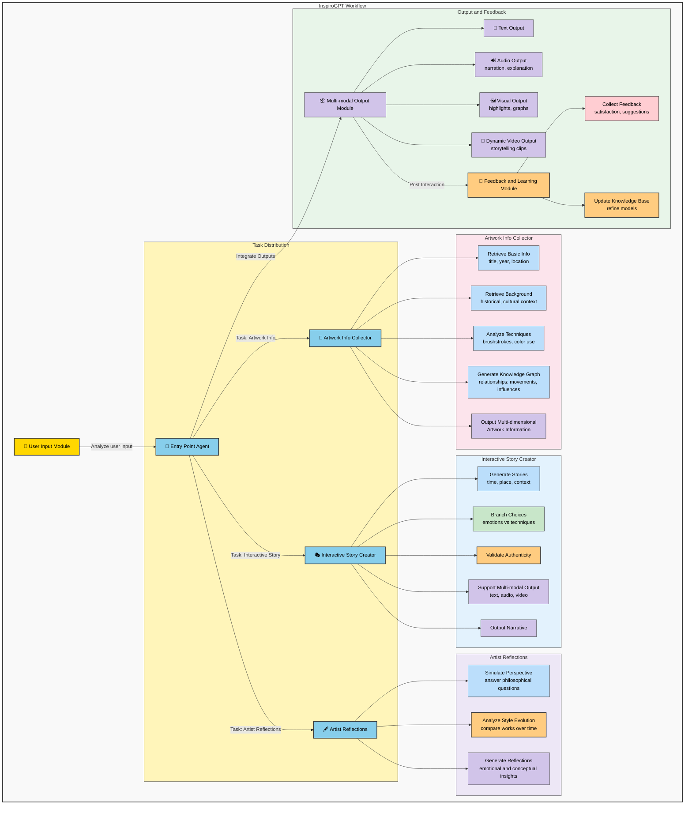
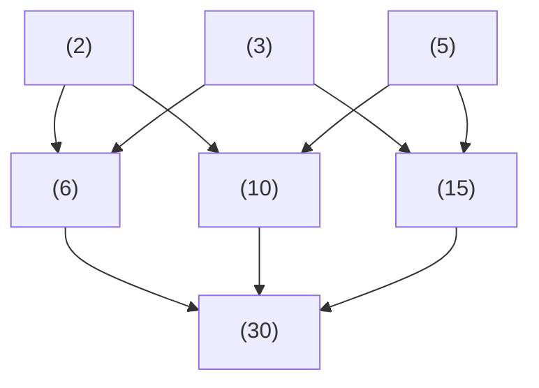

```mermaid
graph TD
    %% 主框架
    subgraph MainFlow [InspiroGPT Workflow]
        style MainFlow fill:#f9f9f9,stroke:#333,stroke-width:2

        A[🎤 User Input Module]:::start
        style A fill:#ffd700,stroke:#333,stroke-width:2

        A -->|Analyze user input| B[🧠 Entry Point Agent]:::processing
        style B fill:#87CEEB,stroke:#333,stroke-width:2

        %% 垂直布局的任务分配
        subgraph TaskDistribution [Task Distribution]
            style TaskDistribution fill:#fff5ba,stroke:#333,stroke-width:1
            B -->|Task: Artwork Info| C[📜 Artwork Info Collector]:::module
            B -->|Task: Interactive Story| D[🎭 Interactive Story Creator]:::module
            B -->|Task: Artist Reflections| E[🖋️ Artist Reflections]:::module
        end

        %% Artwork Info Collector 子模块
        subgraph ArtworkCollector [Artwork Info Collector]
            style ArtworkCollector fill:#fce4ec,stroke:#333,stroke-width:1
            C --> C1[Retrieve Basic Info\ntitle, year, location]:::info
            C --> C2[Retrieve Background\nhistorical, cultural context]:::info
            C --> C3[Analyze Techniques\nbrushstrokes, color use]:::info
            C --> C4[Generate Knowledge Graph\nrelationships: movements, influences]:::info
            C --> C5[Output Multi-dimensional\nArtwork Information]:::output
        end

        %% Interactive Story Creator 子模块
        subgraph StoryCreator [Interactive Story Creator]
            style StoryCreator fill:#e3f2fd,stroke:#333,stroke-width:1
            D --> D1[Generate Stories\ntime, place, context]:::info
            D --> D2[Branch Choices\nemotions vs techniques]:::decision
            D --> D3[Validate Authenticity]:::processing
            D --> D4[Support Multi-modal Output\ntext, audio, video]:::output
            D --> D5[Output Narrative]:::output
        end

        %% Artist Reflections 子模块
        subgraph ArtistReflection [Artist Reflections]
            style ArtistReflection fill:#ede7f6,stroke:#333,stroke-width:1
            E --> E1[Simulate Perspective\nanswer philosophical questions]:::info
            E --> E2[Analyze Style Evolution\ncompare works over time]:::processing
            E --> E3[Generate Reflections\nemotional and conceptual insights]:::output
        end

        %% 输出模块
        B -->|Integrate Outputs| F[📦 Multi-modal Output Module]:::output
        subgraph OutputModule [Output and Feedback]
            style OutputModule fill:#e8f5e9,stroke:#333,stroke-width:1
            F --> F1[📄 Text Output]:::output
            F --> F2[🔊 Audio Output\nnarration, explanation]:::output
            F --> F3[🖼️ Visual Output\nhighlights, graphs]:::output
            F --> F4[🎥 Dynamic Video Output\nstorytelling clips]:::output

            %% Feedback and Learning Module
            F -->|Post Interaction| G[🔄 Feedback and Learning Module]:::processing
            G --> G1[Collect Feedback\nsatisfaction, suggestions]:::feedback
            G --> G2[Update Knowledge Base\nrefine models]:::processing
        end
    end

    %% 样式定义
    classDef start fill:#ffd700,stroke:#333,stroke-width:2,color:#000
    classDef module fill:#87CEEB,stroke:#333,stroke-width:2,color:#000
    classDef info fill:#bbdefb,stroke:#333,stroke-width:1,color:#000
    classDef decision fill:#c8e6c9,stroke:#333,stroke-width:1,color:#000
    classDef processing fill:#ffcc80,stroke:#333,stroke-width:2,color:#000
    classDef output fill:#d1c4e9,stroke:#333,stroke-width:1,color:#000
    classDef feedback fill:#ffcdd2,stroke:#333,stroke-width:1,color:#000
```

```mermaid
  graph TD;
    id2["(2)"] --> id6["(6)"];
    id2["(2)"] --> id10["(10)"];
    id3["(3)"] --> id6["(6)"];
    id3["(3)"] --> id15["(15)"];
    id5["(5)"] --> id10["(10)"];
    id5["(5)"] --> id15["(15)"];
    id6["(6)"] --> id30["(30)"];
    id10["(10)"] --> id30["(30)"];
    id15["(15)"] --> id30["(30)"];
```